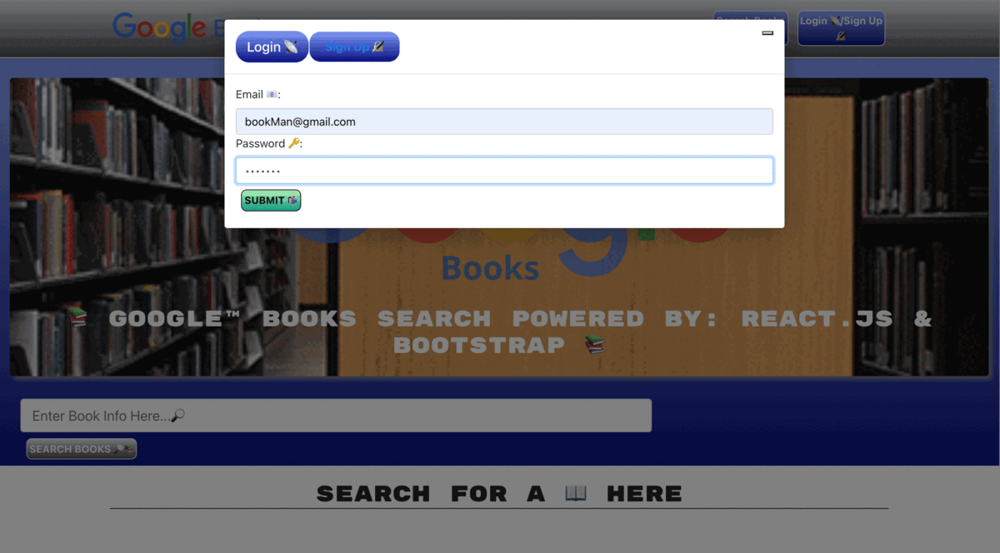

# **MERN Google Book Search** [](#isc-license)
---

## Overview
---
**MERN Google Book Search** is a webpage application powered by dynamic ```JavaScript``` via a "back-end" structure utilizing ```REACT.js``` with dependencies on ```MongoDB```, ```Mongoose```, ```GraphQL```, and ```Apollo``` for data maintenance, storage and queries. Additionally, the client-side will feature a user-friendly and intuitive experience by incorporating an ```HTML``` back-bone strongly supported by the ```REACT.js``` build technology.

This application allows users to search and save their favorite books using the data retrieved from ```Google Books API```. Furthermore, the site will feature secure login technology via ```JSONwebtokens``` combined with ```Bcrypt``` password encryption, in order to ensure user privacy in the form of secured data.

Overall, **MERN Google Book Search**  follows the ```MERN``` concept referencing "full-stack" development with a ```JavaScript``` powered "back-end" and a dynamic "front-end" rendered using ```REACT.js```. All of these combined languages and processes create the unique user experience while visiting the application's pages deployed via ```Heroku```. 

## Table of Contents
---

  * [Overview](#overview)
  * [User Story](#user-story)
  * [Acceptance Criteria](#acceptance-criteria)
  * [Installation](#installation)
  * [Mock Up](#mock-up)
  * [Deployed Application](#deployed-application)
  * [GitHUB Repository](#github-repository)
  * [Evaluation Guideline](#evaluation-guideline)
  * [Questions](#questions)
  * [License](#isc-license)

## User Story
---

```md
AS AN avid reader
I WANT to search for new books to read
SO THAT I can keep a list of books to purchase
```

## Acceptance Criteria
---
> **Note:** The following criteria is used to determine if the standards set for **MERN Google Book Search** have been met:

```md
GIVEN a book search engine
WHEN I load the search engine
THEN I am presented with a menu with the options Search for Books and Login/Signup and an input field to search for books and a submit button
WHEN I click on the Search for Books menu option
THEN I am presented with an input field to search for books and a submit button
WHEN I am not logged in and enter a search term in the input field and click the submit button
THEN I am presented with several search results, each featuring a book’s title, author, description, image, and a link to that book on the Google Books site
WHEN I click on the Login/Signup menu option
THEN a modal appears on the screen with a toggle between the option to log in or sign up
WHEN the toggle is set to Signup
THEN I am presented with three inputs for a username, an email address, and a password, and a signup button
WHEN the toggle is set to Login
THEN I am presented with two inputs for an email address and a password and login button
WHEN I enter a valid email address and create a password and click on the signup button
THEN my user account is created and I am logged in to the site
WHEN I enter my account’s email address and password and click on the login button
THEN I the modal closes and I am logged in to the site
WHEN I am logged in to the site
THEN the menu options change to Search for Books, an option to see my saved books, and Logout
WHEN I am logged in and enter a search term in the input field and click the submit button
THEN I am presented with several search results, each featuring a book’s title, author, description, image, and a link to that book on the Google Books site and a button to save a book to my account
WHEN I click on the Save button on a book
THEN that book’s information is saved to my account
WHEN I click on the option to see my saved books
THEN I am presented with all of the books I have saved to my account, each featuring the book’s title, author, description, image, and a link to that book on the Google Books site and a button to remove a book from my account
WHEN I click on the Remove button on a book
THEN that book is deleted from my saved books list
WHEN I click on the Logout button
THEN I am logged out of the site and presented with a menu with the options Search for Books and Login/Signup and an input field to search for books and a submit button  
```
## Installation
----
> **Important:** Once, the source code has been cloned from the repository @https://github.com/AASports89/book-search-engine

 Enter the following to initiate the required application package installations & run process:

 ```
 npm run install concurrently
 ```
 -followed by-
 ```
 npm run build concurrently
 ```
 -followed by-
 ```
 npm run develop
 ```
 in the terminal cmd to install & run locally via PORT 3000.

## Mock-Up
---
> **Note:**  The following animation shows the application's look and functionality:

> **Application Look:** 

## Deployed Application
---
> https://hidden-wave-60496.herokuapp.com/
## GitHUB Repository
---
> https://github.com/AASports89/book-search-engine

## Evaluation Guideline
---
> **Note**: The following evaluation guideline is used to determine if **MERN Google Book Search** meets the requirements for a minimum viable product:

### Technical Acceptance Criteria: 40%
---
Satisfies all of the preceding acceptance criteria plus the following:

Has an Apollo Server that uses GraphQL queries and mutations to fetch and modify data, replacing the existing RESTful API.

Use an Apollo Server and apply it to the Express.js server as middleware.

Include schema settings for resolvers and typeDefs as outlined in the Challenge instructions.

Modify the existing authentication middleware to work in the context of a GraphQL API.

Use an Apollo Provider so that the application can communicate with the Apollo Server.

Application must be deployed to Heroku.

### Deployment: 32%
---
Application deployed at live URL.

Application loads with no errors.

Application GitHub URL submitted.

GitHub repository contains application code.

### Application Quality: 15%
---
User experience is intuitive and easy to navigate.

User interface style is clean and polished.

Application resembles the mock-up functionality provided in the Challenge instructions.

### Repository Quality: 13%
---
Repository has a unique name.

Repository follows best practices for file structure and naming conventions.

Repository follows best practices for class/id naming conventions, indentation, quality comments, etc.

Repository contains multiple descriptive commit messages.

Repository contains a high-quality README file with description, screenshot, and link to the deployed application.

## Questions
---
> **Note:** For any troubleshooting and/or functionality related questions, please visit my GitHUB @https://github.com/AASports89.

## **ISC License**
---
**Copyright © 2022 - AASports89**

Permission to use, copy, modify, and/or distribute this software for any purpose with or without fee is hereby granted, provided that the above copyright notice and this permission notice appear in all copies.

THE SOFTWARE IS PROVIDED "AS IS" AND THE AUTHOR DISCLAIMS ALL WARRANTIES WITH REGARD TO THIS SOFTWARE INCLUDING ALL IMPLIED WARRANTIES OF MERCHANTABILITY AND FITNESS. IN NO EVENT SHALL THE AUTHOR BE LIABLE FOR ANY SPECIAL, DIRECT, INDIRECT, OR CONSEQUENTIAL DAMAGES OR ANY DAMAGES WHATSOEVER RESULTING FROM LOSS OF USE, DATA OR PROFITS, WHETHER IN AN ACTION OF CONTRACT, NEGLIGENCE OR OTHER TORTIOUS ACTION, ARISING OUT OF OR IN CONNECTION WITH THE USE OR PERFORMANCE OF THIS SOFTWARE.

---
---